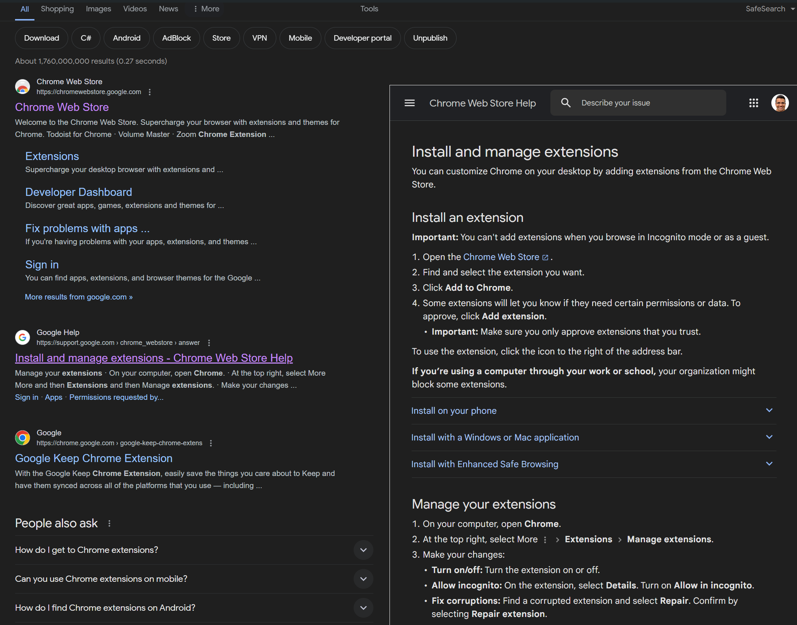
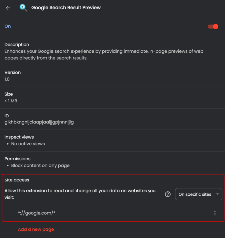

# Google Search Result Preview Extension for Chrome

Enhances your Google search experience by providing immediate, in-page previews of web pages directly from the search results. This extension is specifically designed to work seamlessly on Google's "All" and "Videos" search results tabs, enabling users to view content without leaving the search page.

## Features

1. **Instant Previews**: Simply hover over any link in the "All" or "Videos" search results to open a preview of the webpage in an adjustable iframe on the same page.
2. **Smart Activation**: The extension activates only on the Google search results for "All" and "Videos", ensuring it is both unobtrusive and efficiently focused on relevant content.
3. **User-Friendly**: Previews load with a slight delay when hovering over a link, preventing unwanted pop-ups and enhancing the browsing experience.
4. **Easy Navigation**: Iframe previews can be closed by clicking outside the iframe, making it easy to return to your search results.
5. **Privacy and Performance**: The extension requires minimal permissions and is designed to have a negligible impact on your browsing speed and privacy.

## Installation

Download the source code of the extension and load the unpacked extension from the **src** directory. You can follow the instructions outlined in the [Google documentation](https://developer.chrome.com/docs/extensions/get-started/tutorial/hello-world#load-unpacked) if you are new at this.

## Important Security Warning

This extension modifies HTTP request headers by removing certain security restrictions, such as `X-Frame-Options` and `Content-Security-Policy`, which are designed to prevent web pages from being displayed within iframes on other sites. These headers are important for protecting against clickjacking and other malicious attacks.

## How to Restrict the Extension

To limit the extension's activity to just Google Search, ensure the extension’s permissions and site access settings in Chrome are set to work only on URLs associated with Google Search results. The following screenshot demonstrates how to restrict the site access permissions for the extension:

